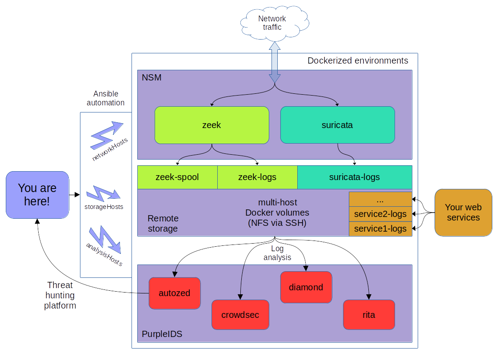

# PurpleSec
This is __PurpleSec__, a collection of dockerfiles, docker-compose configurations, ansible roles and playbooks with practical __security automation__ applications.
It is an attempt to collect some of my other standalone repos into one comprehensive set of tools focused on automation.
Though most of the effort goes to the cyber defense part, some future components will include recon and stealth behavior to emulate attackers in realistic scenarios.

The philosophy behind purplesec follows these basic principles:
  - low resource footprint (memory, I/O, cpu);
  - usability through simplicity;
  - focus on the most likely attack vectors first.

The ultimate goal is to provide a collection of modules that can be applied to most environments, with minimal manual setup, that provide tangible results without spending hundreds of hours learning how to use that particular vendor's solution.

Powered by open source software. Currently tested on debian-like environments only.

# Features
Current bundles that support automated deployment include:
 * a __network security monitor__ powered by Zeek and Suricata;
 * __log analysis services__ with the following capabilities:
   * spot __beacons__ in network traffic;
   * detect the most common __probing__, __brute forcing__, __DoS__ and __exploitation__ attempts against web servers;
   * highlight __observables__ of interest for __threat hunting__ purposes. These include IP addresses, domain names, fingerprints and URLs;
 * a __Zed data lake__ accessible via Zui for threat hunting;
 * a __vulnerable web app__ (DVWA) for testing the system's capabilities.

I encourage you to take a look at my other repos that appear as submodules for purplesec.

From the perspective of data flows, there are three distinct logical elements: __log producers__, __log collectors__ and __log consumers__. These three categories become more evident when orchestrating through ansible.

Purplesec's capabilities sit between home firewalls and more sophisticated XDRs, driving homelabs and smaller organizations from zero to decent intrusion detection and response.

# High level overview


## Some notes on log collection
For log collection, a clever way of deploying docker volumes is used. After struggling with Elasticsearch for long I realized that for low-budget security use cases Elasticsearch is way too resource hungry compared to the actual benefits it provides. Therefore, I developed a heavily automated system for sharing __docker volumes across multiple hosts__ instead. By automated I mean it can be deployed at scale using ansible playbooks and roles.

Here's how it works. At least one NFS server accepting requests from localhost only is setup. Docker hosts open SSH tunnels to NFS hosts so that they can access NFS exports through secure channels. Whenever required, some ansible roles make sure NFS hosts and docker hosts agree when mapping docker volume names to remote NFS exports.
The result is effortless and transparent data sharing through SSH tunnels, between containers regardless of their physical location and the docker host they are running on, for both reading and writing data.

In practice, importing or exporting logs across hosts becomes equivalent to simply defining a docker volume and mounting it inside the desired container, while SSH and NFS do their magic behind the scenes.


Purplesec follows a strict directory structure:
 * ./docker folder, containing all docker compose bundles, and referred to by several ansible roles
 * ./ansible folder, containing playbooks and roles for deploying docker configurations in your environment
 * some bash scripts to bootstrap common scenarios

Refer to subdirectories for more specific information.

Though the current setup is specific to security monitoring, some potential general applications are emerging from some of the ansible roles and playbooks I have been writing. By general applications I mean the same process that powers automation in purplesec can be applied to any docker-compose bundle one wishes to deploy across hosts. I will probably leverage them on a separate repo dedicated to docker orchestration soon.


# Usage

Set the name of the interface of the host your NSM will run on:
```
$ bash setup.sh
```
Now set up your inventory following the given template:
```
$ cp templates/inventory.template ansible/.inventory 
```
Place an ansible vault for credentials and other sensitive data (this in highly encouraged):
```
$ EDITOR=your-favorite-editor ansible-vault create ansible/.vault
```
__SSH at least once in storage hosts to fill up your ~/.ssh/known_hosts__, then place the file in ansible/.ssh/known_hosts so that docker hosts can open ssh tunnels to storage hosts non-interactively and securely
```
$ mkdir ansible/.ssh
$ cp ~/.ssh/known_hosts ansible/.ssh/known_hosts
```
edit ansible/vars/main.yml and set the required volumes and parameters, according to the template
```
cp templates/vars.yml.template ansible/vars/main.yml
```
Now you can push the whole ecosystem at once!
```
$ bash ansible.sh ansible/push-compose.yml
```
Check ./ansible for more playbooks.


# Some tips for this specific setup
The current setup includes the 9xeb/purpleids, 9xeb/nsm and 9xeb/netpot compose configurations.
Additionally, 9xeb/sigmalert is present but will not be used.

Below you can find some tips to tailor your specific setup.


In *docker/purpleids/rita/config.yaml*:
 * Edit 'Filtering: InternalSubnets' to add any additional IP range to treat as internal;
 * Edit 'Filtering: AlwaysInclude' to add any IP to exempt from internal filtering. Typically you should put your internal DNS servers here so that internal DNS queries are recorded.

In *docker/nsm/zeek*:
 * Check zeek docs if you need to change the default list of networks to be considered as internal.

# Future additions
- Attack surface recon, automated red teaming with toolchains, from org name to vulnerabilities, through asset discovery and OSINT;
- Remote security assessments via ssh.


